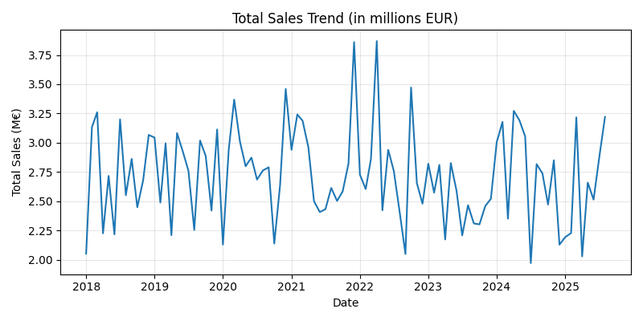
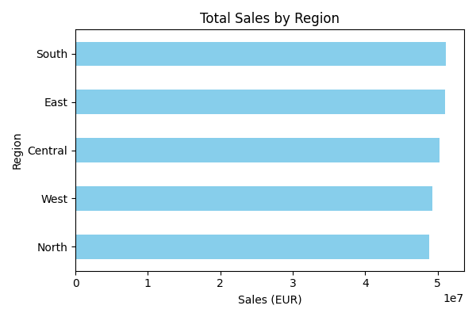
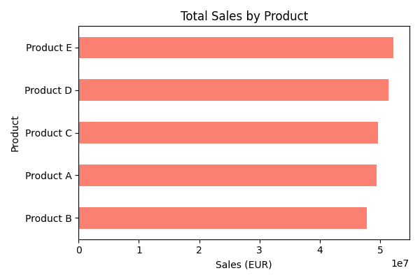

# Sales Performance Analytics Dashboard

This repository contains a **comprehensive sales analytics project** that mirrors a real‑world reporting scenario.  The data has been scaled up and the dashboards have been polished to give you everything you need to explore performance across products, regions and time.

## ✨ Points clés / Key points

• **Dashboards:** A consolidated view of sales performance by region and product, with interactive slicers for time periods and categories.

• **KPIs:** total revenue, units sold, gross profit, average selling price, profit margin, growth rates.

• **Comparisons:** across regions, products and years to highlight strong and weak performers.

• **Cartographie et storytelling:** geographical breakdown by region and dynamic narrative generated with DAX that summarises key trends.

• **Learning focus:** a clean and extensible data model, documented measures and reproducible steps to build your own dashboards in Power BI.

## 🗂 Datasets

Two CSV files are provided:

- **`sales_data.csv`** – the original small dataset for quick prototypes (monthly records from Jan 2023 to Aug 2025, ~400 rows).

- **`sales_data_large.csv`** – a much larger dataset (~5 000 rows) covering **Jan 2018 through Dec 2025**, five regions and five products.  Each row contains:

  | Column | Description |
  |---|---|
  | `Date` | Year‑month (YYYY‑MM) of the sales record. |
  | `Region` | Geographic area (`North`, `South`, `East`, `West` or `Central`). |
  | `Product` | One of five products (A–E). |
  | `Sales` | Revenue in euros for the product/region/month. |
  | `Units` | Quantity sold. |
  | `Profit` | Gross profit in euros (calculated from a random margin of 10–30 %). |

These datasets are synthetic yet realistic.  The larger one provides enough granularity to perform robust analyses, such as month‑over‑month and year‑over‑year comparisons.  You can load it into Power BI via *Get data → Text/CSV*.

## 📐 Metrics (aperçu / preview)

- **Total sales** = sum of `Sales`.
- **Units sold** = sum of `Units`.
- **Gross profit** = sum of `Profit`.
- **Average selling price (ASP)** = `Sales` ÷ `Units`.
- **Profit margin (%)** = `Profit` ÷ `Sales`.
- **Growth rate** = (`Sales` this period – `Sales` previous period) ÷ `Sales` previous period.

## 🧠 Modèle et fonctionnalités / Model & features

- A **date table** with year, quarter and month attributes to enable time intelligence (e.g., MoM, QoQ, YoY comparisons).
- Calculated columns for fiscal periods or product hierarchy if needed.
- **DAX measures** implementing KPIs and narrative summaries (e.g., “Revenue increased by 12 % compared with last year”).
- Visuals include KPI cards, line and column charts, bar charts by region and product, doughnut charts for margin distribution and narrative text boxes.

## 🗺️ Feuille de route / Roadmap

- Enrich the data with marketing spend or promotions to analyse ROI.
- Implement dynamic alert thresholds that highlight regions or products below target.
- Create advanced tooltips and decomposed tree visuals to drill into anomalies.
- Compare performance month‑over‑month and year‑over‑year with seasonality analysis.
- Publish the report to Power BI Service and schedule automatic refreshes.

## ⚠️ Hypothèses & limitations / Assumptions & limitations

- The data is **synthetic** and generated randomly; it does not reflect any real company’s performance.
- Profit margins are randomly assigned between 10 % and 30 %.
- Seasonality patterns are generic; adjust them to reflect your actual business context.
- Use this project as an educational example; it is not intended for operational decision‑making.

## 🔧 Stack

**Python (pandas, matplotlib)** for data generation and chart creation, **Power Query** and **DAX** for data modelling, and **Power BI Desktop** for building interactive dashboards.

## 🖼️ Aperçu des tableaux de bord / Dashboard examples

Below are a few example visuals generated from the large dataset.  In Power BI you can reproduce these and build additional ones.

| Image | Description |
|---|---|
|  | Total sales across all regions and products from 2018–2025.  This line chart reveals seasonality and growth trends. |
|  | Total sales by region.  Compare which areas generate the most revenue. |
|  | Total sales by product.  Highlight which products drive the business. |

## 📄 Licence & attributions

This code and documentation are released under the **MIT License**.  The datasets are synthetic and generated for educational purposes only.  Logos or trademarks used in sample visuals belong to their respective owners.

## 🙋‍♂️ Contact

Author: **Raju** – [GitHub](https://github.com/saiiii4444)  
If you have questions or suggestions, feel free to open an issue or reach out via email.